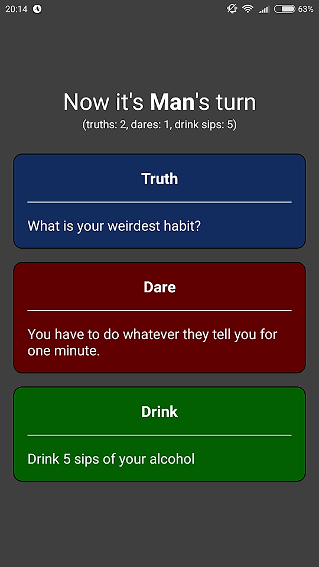

# Truth Dare Drink
A simple [React Native](https://github.com/facebook/react-native) / [Expo](https://github.com/expo/expo) project - clone of a popular Truth or Dare game.
Free to edit and use. You may use it to create your own Android and/or iOS app with similar or same rules.

- [How to run it?](#how-to-run-it)
- [Forks and PRs (modifications)](#forks-and-prs)
- [License](#license)

## How to run it?
1. You need [Expo](https://docs.expo.io/versions/latest/) on your computer
and [a mobile app](https://docs.expo.io/versions/v31.0.0/introduction/installation#mobile-client-expo-for-ios-and-android) on your smartphone.
2. To run it locally use `expo start`, scan the QR code with the app installed on your smarthpone and you're good to go
(more details in the links above).
3. To export it as an installable app check out [this page](https://docs.expo.io/versions/latest/distribution/building-standalone-apps).

## Forks and PRs
If you want to fork the repository or make any pull requests - do it. Below you can find some information about
the crucial places in code and the simple changes that may help you adjust the application accordingly to your needs.

### Simple changes

#### Change player names
Go to [App.js](App.js) and edit the values for `name` keys in the `PLAYERS` object.

#### Change minimum and maximum drink sips values
Go to [App.js](App.js) and edit the numeric values in the `_getDrink` function.

#### Add/remove/change the truths/dares base
Check out [TruthBase.js](data/TruthBase.js) and [DareBase.js](data/DareBase.js).

#### Change game colors
Go to [ColorsContants.js](ColorsContants.js) and edit constants' hex values.

#### Change game icon and splash screen
Modify the [icon](assets/icon.png) and [splash](assets/splash.png) files.

#### Add genders
Go to [Common.js](data/Common.js), add new gender constants and extend the `SEX_ARRAY` (you may also change the constant name).
You might as well want to change the `PLAYERS` object in the [App.js](App.js) accordingly.

### Challenges

#### Add database
It was supposed to be a quick, simple project and connecting to and managing the database would require more time to do it.
If you want to fork the project and add database related code - just do it. Right now all the values are stored as constants in the code
and it does not seem to affect the application responsiveness.

#### Add player name and sex/gender choice screen
The `PLAYERS` object in [App.js](App.js) contains hard coded names and sex values. You might want to add a starting screen
from which the user chosen data would be passed as a similar object to the main game component.

#### Add more players
In the best case scenario the `PLAYERS` object in [App.js](App.js) would have to be extended or proper fields would have to be added
to the name/sex choice screen (see the point above).

In the worst case scenario additional changes would have to be made in other places in the code (tested only for 2 players).

## License
MIT